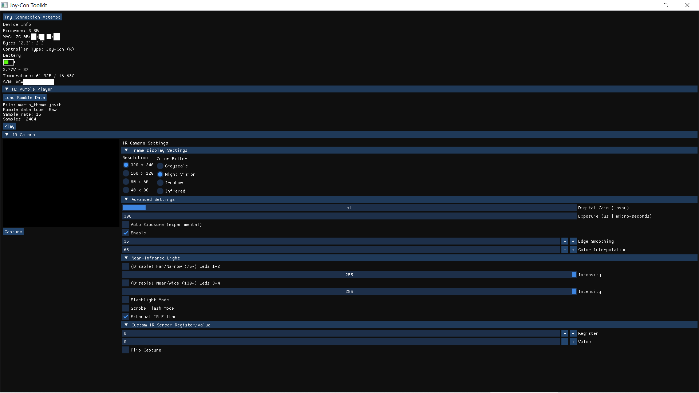

# Joy-Con Toolkit (dev-api branch)
The OG Joy-Con Toolkit is now accessible as an API.
The goal is to eliminate the dependency to CppWinForm UI framework and expose an API for our fellow joy-con hackers. Feel free to create a pull request if you want to contribute to the API.

TODOS:
  - Linux support
    - Access hid devices.
  - Port UI using ImGui as a UI framework.


**Alpha API** with ImGui Screen shot:



Build the project with with CMake to get the above result.

Add the following line after the project() declaration to build the project with CMake as API only:
```
set(JCTOOL_API_ONLY TRUE) # Add this line.
# Uncomment the following line you are building the project from a parent directory.
# add_subdirectory(jc_toolkit)
```
Below is a screen cap of the original Joy-Con Toolkit program using the CppWinForm UI framework:


This image is for reference.

## Prerequisites:

**Microsoft Visual C++ 2017 (x86) Redistributable** (All Windows versions)

**Microsoft .NET Framework 4.7.1** (for Windows lower than Windows 10)

## References:

**Official forum** and **Binary releases**: https://gbatemp.net/threads/tool-joy-con-toolkit-v1-0.478560/

**Protocol reverse engineering**: https://github.com/dekuNukem/Nintendo_Switch_Reverse_Engineering

**Protocol and hidapi usage in Linux**: https://github.com/shinyquagsire23/HID-Joy-Con-Whispering

**In windows**: https://github.com/shuffle2/nxpad
