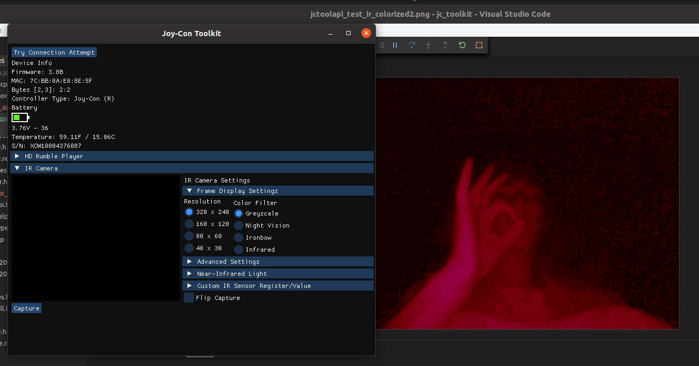

# Joy-Con Toolkit (dev-api branch | Windows/Linux)
The OG Joy-Con Toolkit is now accessible as an API.
The goal is to eliminate the dependency to CppWinForm UI framework and expose an API for our fellow joy-con hackers. Feel free to create a pull request if you want to contribute to the API.

TODOS:
- [ ] Port Orginal UI from CppWinForm using ImGui as a UI framework.

  - [x] Show Controller Information
    - [x] S/N, FW, MAC ... etc.
    - [x] Battery and Temperature Information
    
  - [x] HD Rumble Player
  
  - [ ] Device Colors

  - [ ] Playground Testing
    - [ ] Button Test
    - [ ] NFC Reader
    - [ ] Stick Calibration
    - [ ] Acc/Gyro Calibration
    - [ ] 6-Axis and Stick Device Parameters
    
  - [x] IR Camera
    - [x] IR Camera Settings
    - [x] IR Camera Capture/Stream
    
  - [ ] User Calibration and Stick Device Parameters

**Alpha API** with ImGui Screen shot:



Build the project with with CMake to get the above result.

Add the following line after the project() declaration to build the project with CMake as API only:
```
set(JCTOOL_API_ONLY TRUE) # Add this line.
# Uncomment the following line you are building the project from a parent directory.
# add_subdirectory(jc_toolkit)
```
### A note for linux users (Important)

You must have valid udev rules in order for Joy-Con Toolkit to detect your controllers.
Follow the steps below if you need the valid udev rules.

1. Find the file named "50-nintendo-switch.rules" in the root directory of the repo.

2. Run the command to copy the file into the udev rules directory:
```
sudo cp ./50-nintendo-switch.rules /etc/udev/rules.d
```
3. Reconnect your controller if it was already connected.

Below is a screen cap of the original Joy-Con Toolkit program using the CppWinForm UI framework:


This image is for reference.

## Prerequisites:

**Microsoft Visual C++ 2017 (x86) Redistributable** (All Windows versions)

**Microsoft .NET Framework 4.7.1** (for Windows lower than Windows 10)

## References:

**Official forum** and **Binary releases**: https://gbatemp.net/threads/tool-joy-con-toolkit-v1-0.478560/

**Protocol reverse engineering**: https://github.com/dekuNukem/Nintendo_Switch_Reverse_Engineering

**Protocol and hidapi usage in Linux**: https://github.com/shinyquagsire23/HID-Joy-Con-Whispering

**In windows**: https://github.com/shuffle2/nxpad
